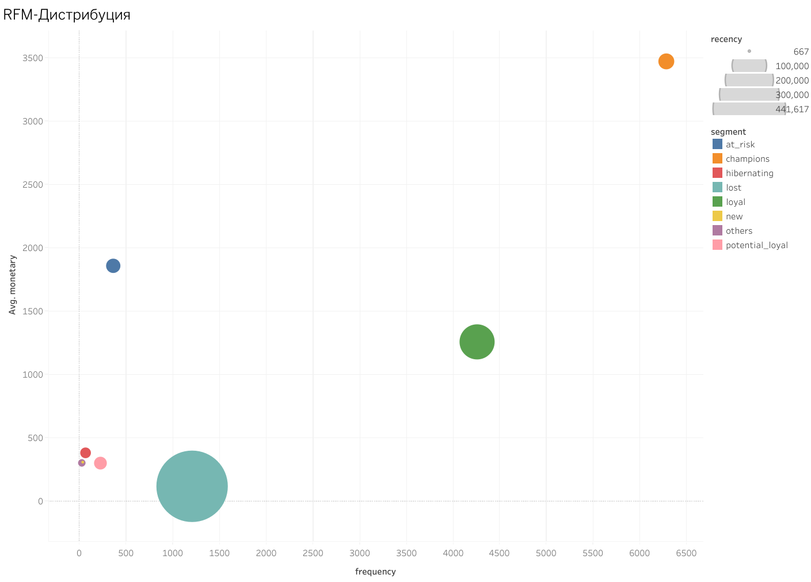

#   RFM Сегментация клиентов

> Сегментация клиентов на основе RFM анализа для персонализированного маркетинга

---

##   Обзор проекта

RFM анализ 2,000 клиентов для создания сегментов с персонализированными маркетинговыми стратегиями.

**RFM метрики:**
- **R - Recency (Давность):** Сколько дней назад была последняя покупка?
- **F - Frequency (Частота):** Сколько раз клиент покупал?
- **M - Monetary (Деньги):** Сколько всего потратил?

---

##   Найденные сегменты

| Сегмент | % клиентов | % выручки | Описание |
|---------|------------|-----------|----------|
|   Чемпионы | 23% | 60% | Лучшие клиенты - часто, недавно, много |
|   Лояльные | 33% | 31% | Постоянные покупатели |
|   В зоне риска | 2.4% | 3.4% | В зоне риска - были активны, пропали |
|   Новые | 0.6% | 0.14% | Новички |
|   Потенциальные лояльные | 3.85% | 0.88% | Потенциал роста |
|   Спящие | 1.1% | 0.32% | Спящие |
|   Потерянные | 36% | 3.3% | Потерянные |

**Ключевой инсайт:** 50% клиентов (Чемпионы + Лояльные) приносят 90% выручки

---

##   Стратегии по сегментам

**💎 Чемпионы:** VIP-программа, ранний доступ к новинкам  

**⚠️ В зоне риска:** Win-back кампания, персональная скидка

**❤️ Лояльные:** Программа лояльности с баллами, регулярные email с персонализацией

**🌱 New Customers:** Welcome-серия, обучение, скидка на 2-ю покупку

---

##   Бизнес-эффект

**Прогноз (6 месяцев):**
- Возврат 20% сегмента "В зоне риска" = +19 клиентов
- Развитие сегмента "Лояльные" = +164 клиента-"чемпиона"
- ROI win-back кампаний: 500-800%

---

##   Технологии

- **SQL (BigQuery)** - RFM расчёт, сегментация, статистика
- **Tableau Public** - Интерактивные scatter plots, дашборды
- **Excel** - Анализ стратегий

---

##   Визуализации

**[→ Открыть интерактивный дашборд](https://public.tableau.com/views/rfm_analysis_17652859685770/Dashboard1?:language=en-US&:sid=&:redirect=auth&:display_count=n&:origin=viz_share_link)**

---

##   Контакты

**Ирина Дмитриева**
- 💼 LinkedIn: [Профиль](https://www.linkedin.com/in/irinadm/)
- 📧 Email: irene.dm.alex@gmail.com
- 📊 Tableau: [Все дашборды](https://public.tableau.com/app/profile/irina.dmitrieva/vizzes)

---

##   Дополнительная информация

- **Использованные инструменты:** SQL, Tableau Public, Google Sheets, BigQuery
- **Демонстрируемые навыки:** Маркетинговая аналитика, Визуализация данных, SQL, Статистический анализ, Бизнес-стратегия
- **Длительность проекта:** 1 неделя
- **Источник данных:** Синтетические данные для демонстрации портфолио
